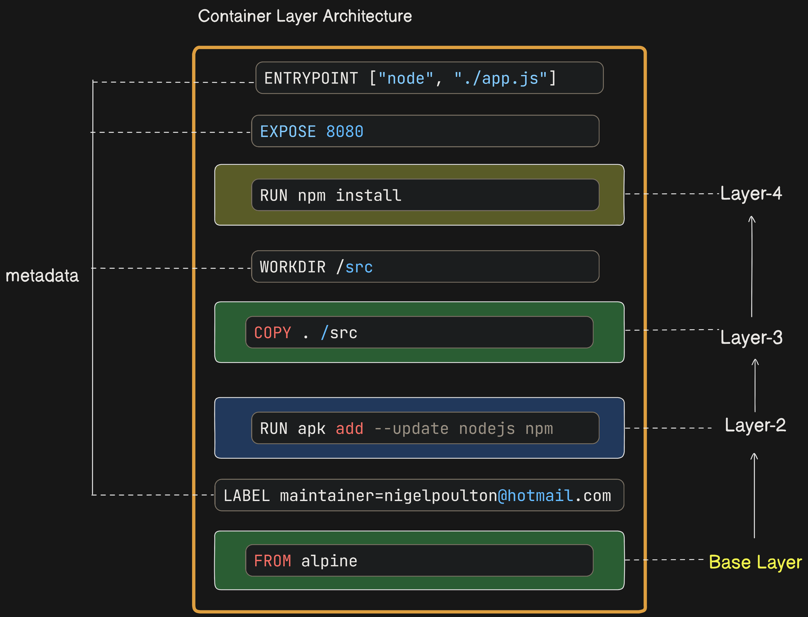
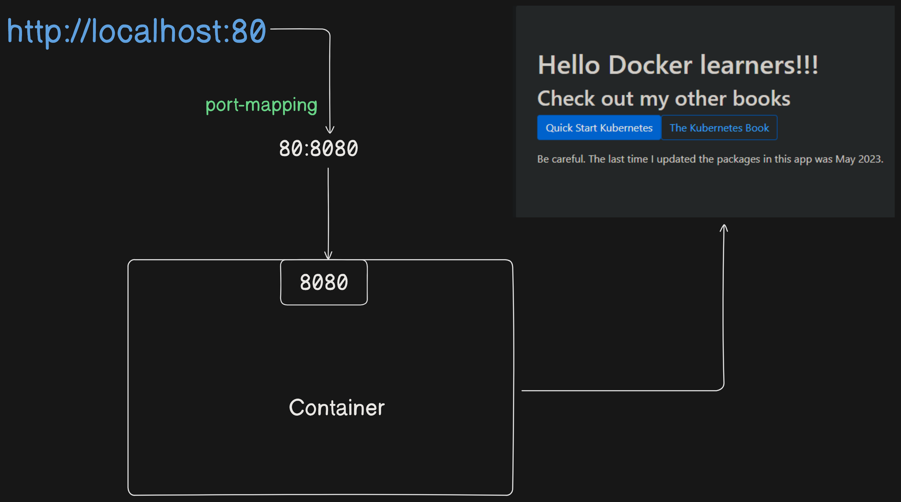

# Containerize a Single-Container App
We'll walk through the process of containerizing a simple Node.js app by following these steps:
1. Clone the repo to get the app code.
2. Inspect the Dockerfile.
3. Containerize the app.
4. Run the app.
5. Test the app.
6. Look a bit closer.

### Getting the Application Code
Clone the application code from the GitHub repository:

```bash
$ git clone https://github.com/nigelpoulton/ddd-book.git
$ cd ddd-book/web-app
$ ls -l
```

### Inspecting the Dockerfile
A Dockerfile describes an application and tells Docker how to build it into an image.

```dockerfile
FROM alpine
LABEL maintainer="nigelpoulton@hotmail.com"
RUN apk add --update nodejs npm
COPY . /src
WORKDIR /src
RUN npm install
EXPOSE 8080
ENTRYPOINT ["node", "./app.js"]
```

**Dockerfile Instructions and Layers:**

All non-comment lines are instructions and take the format `<INSTRUCTION> <arguments>`. Instruction names are not case sensitive, but it’s normal practice to write them in UPPERCASE to make reading the file easier.

Some instructions create new layers, whereas others just add metadata.

Examples of instructions that create new layers are `FROM`, `RUN`, and `COPY`. Examples that create metadata include `EXPOSE`, `WORKDIR`, `ENV`, and `ENTRYPOINT`. The basic premise is this: if an instruction adds content such as files and programs, it will create a new layer. If it is adding instructions on how to build the image and run the container, it will create metadata.




| **Instruction**                          | **Description**                           | **Layer**             |
|------------------------------------------|-------------------------------------------|-----------------------|
| `FROM alpine`                            | Specifies the base image.                 | Adds a new layer      |
| `LABEL maintainer="nigelpoulton@hotmail.com"` | Adds metadata.                             | Does not add a new layer (metadata only) |
| `RUN apk add --update nodejs npm`        | Installs packages.                        | Adds a new layer      |
| `COPY . /src`                            | Copies files into the image.              | Adds a new layer      |
| `WORKDIR /src`                           | Sets the working directory.               | Does not add a new layer (metadata only) |
| `RUN npm install`                        | Installs Node.js dependencies.            | Adds a new layer      |
| `EXPOSE 8080`                            | Documents the port the app listens on.    | Does not add a new layer (metadata only) |
| `ENTRYPOINT ["node", "./app.js"]`        | Specifies the command to run the application. | Does not add a new layer (metadata only) |

This table clearly shows which Dockerfile instructions add new layers and which only add metadata.

### Containerize the App / Build the Image
Build a new image named `ddd-book:ch8.1`:

```bash
$ docker build -t ddd-book:ch8.1 .
```

Check that the image exists:

```bash
$ docker images
```

### Pushing the Image
To push the image to Docker Hub:

1. Log in to Docker Hub:

    ```bash
    $ docker login
    ```

2. Tag the image with our Docker ID:

    ```bash
    $ docker tag ddd-book:ch8.1 <docker-id>/ddd-book:ch8.1
    ```

    **Why Tag the Image?**
    Tagging the image associates it with our Docker Hub repository. The tag includes registry information, repository name, and version (tag). This makes it possible to push the image to a specific repository under our Docker ID.

3. Push the tagged image to Docker Hub:

    ```bash
    $ docker push <docker-id>/ddd-book:ch8.1
    ```

### Run the App
Run the containerized application:

```bash
$ docker run -d --name c1 -p 80:8080 ddd-book:ch8.1
```

Check that the container is running:

```bash
$ docker ps
```

### Test the App
Open a web browser and navigate to the DNS name or IP address of the Docker host running the container. If using Docker Desktop, we can use `localhost`.



### Looking a Bit Closer
To see the instructions that were used to build the image:

```bash
$ docker history ddd-book:ch8.1
```

Output Example:

```
IMAGE           CREATED BY                                      SIZE
f282569b8bd0    ENTRYPOINT ["node" "./app.js"]                  0B
<missing>       EXPOSE map[8080/tcp:{}]                         0B
<missing>       RUN /bin/sh -c npm install                      24.2MB
<missing>       WORKDIR /src                                    0B
<missing>       COPY . /src #                                   8.41kB  
<missing>       RUN /bin/sh -c apk add --update nodejs npm      63.4MB  
<missing>       LABEL maintainer=nigelpoulton@hotmail.com       0B      
<missing>       /bin/sh -c #(nop) CMD ["/bin/sh"]               0B
<missing>       /bin/sh -c #(nop) ADD file:df7fccc3453b6ec1     7.73MB
```

Two things from the output are worth noting.

First, each line corresponds to an instruction in the Dockerfile (starting from the bottom and working up). The `CREATED BY` column even lists the exact Dockerfile instruction that was executed.

Second, only 4 of the lines displayed in the output create new layers (the ones with non-zero values in the `SIZE` column). These correspond to the `FROM`, `RUN`, and `COPY` instructions in the Dockerfile. The other instructions create metadata instead of layers.

Use the `docker inspect` command to see the list of image layers.

```bash
$ docker inspect ddd-book:ch8.1
```

Output Example (Layers Snippet):

```json
"RootFS": {
    "Type": "layers",
    "Layers": [
        "sha256:94dd7d531fa5695c0c033dcb69f213c2b4c3b5a3ae6e497252ba88da87169c3f",
        "sha256:a990a785ba64395c8b9d05fbe32176d1fb3edd94f6fe128ed7415fd7e0bb4231",
        "sha256:efeb99f5a1b27e36bc6c46ea9eb2ba4aab942b47547df20ee8297d3184241b1d",
        "sha256:ccf07adfaecfba485ecd7274c092e7343c45e539fa4371c5325e664122c7c92b"
    ]
}
```

Figure 8.8 maps the Dockerfile instructions to image layers. The layer IDs will be different in our environment. The Dockerfile instructions with arrows from them create layers; the others don’t.

**Note:** There may be a bug in the builder used by Docker that causes the `WORKDIR` instruction to create a layer. This may cause our environment to show more layers than expected.

### Best Practices
- Use official base images for security and updates.
- Keep Dockerfiles in version control.
- Treat Dockerfiles as documentation for our application.
