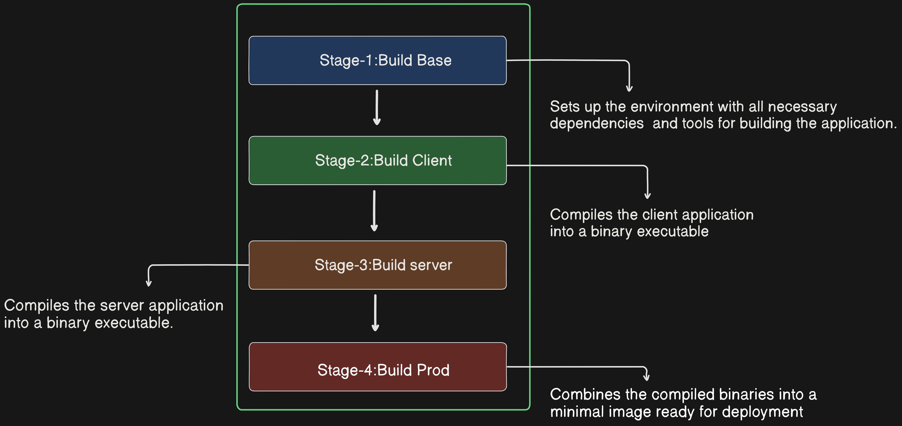

# Moving to Production with Multi-stage Builds

When it comes to Docker images, size matters. Large images can lead to slower build times, increased potential vulnerabilities, and a larger attack surface. To address these concerns, Docker offers multi-stage builds, which allow us to create smaller, more efficient images by splitting the build process into multiple stages.

## Overview of Multi-stage Builds

Multi-stage builds involve having multiple `FROM` instructions in a single Dockerfile. Each `FROM` instruction represents a new build stage. The main idea is to perform the heavy lifting of building our application in a larger image with all the necessary compilers and build tools, and then copy the final production-ready artifacts into a smaller image used for production. This approach helps reduce image size and complexity while also potentially speeding up the build process.

## Example Dockerfile

Let's examine an example Dockerfile for a Go application:

```Dockerfile
FROM golang:1.20-alpine AS base
WORKDIR /src
COPY go.mod go.sum .
RUN go mod download
COPY . .

FROM base AS build-client
RUN go build -o /bin/client ./cmd/client

FROM base AS build-server
RUN go build -o /bin/server ./cmd/server

FROM scratch AS prod
COPY --from=build-client /bin/client /bin/
COPY --from=build-server /bin/server /bin/
ENTRYPOINT ["/bin/server"]
```

### Detailed Explanation



#### Stage 0: Base
```Dockerfile
FROM golang:1.20-alpine AS base
WORKDIR /src
COPY go.mod go.sum .
RUN go mod download
COPY . .
```

- **FROM golang:1.20-alpine AS base**: This sets the base image to `golang:1.20-alpine` and labels this stage as `base`. The `alpine` variant is chosen for its small size.
- **WORKDIR /src**: Sets the working directory inside the container to `/src`.
- **COPY go.mod go.sum .**: Copies the `go.mod` and `go.sum` files to the working directory. These files contain the dependencies for the Go application.
- **RUN go mod download**: Downloads the Go module dependencies specified in the `go.mod` file.
- **COPY . .**: Copies the entire project directory into the working directory inside the container.


#### Stage 1: Build Client

```Dockerfile
FROM base AS build-client
RUN go build -o /bin/client ./cmd/client
```

- **FROM base AS build-client**: Uses the `base` stage as the starting point and labels this stage as `build-client`.
- **RUN go build -o /bin/client ./cmd/client**: Builds the client component of the application and outputs the binary to `/bin/client`.

#### Stage 2: Build Server

```Dockerfile
FROM base AS build-server
RUN go build -o /bin/server ./cmd/server
```

- **FROM base AS build-server**: Uses the `base` stage as the starting point and labels this stage as `build-server`.
- **RUN go build -o /bin/server ./cmd/server**: Builds the server component of the application and outputs the binary to `/bin/server`.

#### Stage 3: Production

```Dockerfile
FROM scratch AS prod
COPY --from=build-client /bin/client /bin/
COPY --from=build-server /bin/server /bin/
ENTRYPOINT ["/bin/server"]
```

- **FROM scratch AS prod**: Starts a new stage from the minimal `scratch` image, which is an empty image ideal for production since it contains nothing by default.
- **COPY --from=build-client /bin/client /bin/**: Copies the client binary from the `build-client` stage to `/bin/` in the current stage.
- **COPY --from=build-server /bin/server /bin/**: Copies the server binary from the `build-server` stage to `/bin/` in the current stage.
- **ENTRYPOINT ["/bin/server"]**: Sets the default command to run when the container starts, which in this case is the server binary.

## Building the Image

To build the Docker image using multi-stage builds, execute the following command:

```bash
$ docker build -t multi:stage .
```

This command builds the Docker image using the Dockerfile in the current directory. The multi-stage build process will execute, resulting in a final production image named `multi:stage`.

## Benefits of Multi-stage Builds

- **Reduced Image Size**: By separating the build process into stages and using smaller base images for production, multi-stage builds result in significantly smaller final images.
- **Improved Security**: Smaller images have fewer potential vulnerabilities and a reduced attack surface, enhancing overall security.
- **Faster Builds**: By parallelizing build steps and optimizing image layers, multi-stage builds can lead to faster build times compared to traditional approaches.

## Conclusion

Multi-stage builds offer a streamlined approach to Docker image creation, allowing us to produce leaner and more secure images for our production environments. By leveraging multiple build stages, we can optimize our Docker build process and create more efficient containers for deployment.