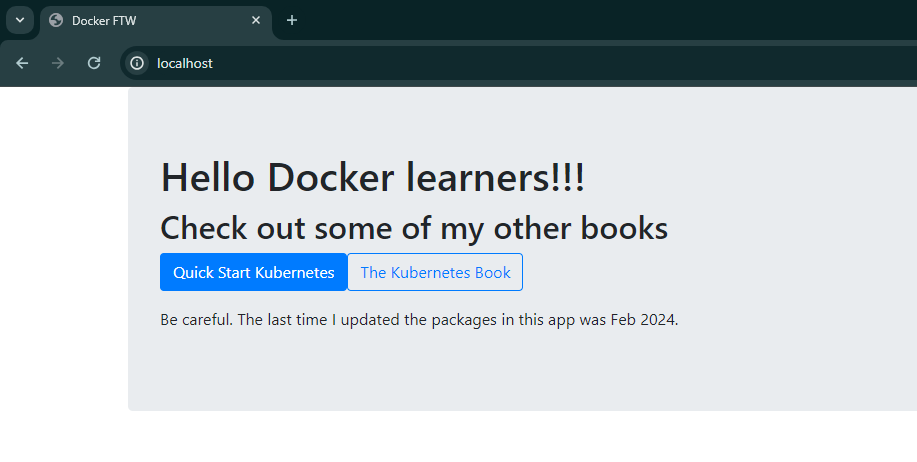

# Running a Web Server in a Docker Container

## Introduction

In this example, we will start a new container from an image containing a simple Node.js app running on port 8080. Before starting, ensure any previous containers are stopped and removed.

### Start a New Web Server Container

Run the following command to start a new web server container:
```sh
$ docker run -d --name webserver -p 80:8080 nigelpoulton/ddd-book:web0.1
```

### Explanation of Command Arguments

- `docker run`: Starts a new container.
- `-d`: Runs the container in detached (daemon) mode, meaning it runs in the background and does not attach to your terminal.
- `--name webserver`: Names the container "webserver".
- `-p 80:8080`: Maps port 80 on the Docker host to port 8080 inside the container. This means that traffic hitting the Docker host on port 80 will be directed to port 8080 inside the container.
- `nigelpoulton/ddd-book:web0.1`: Specifies the image to use for the container. This image contains a Node.js web server and all dependencies.

### Verify Container Status

Use the `docker ps` command to verify the container is running and view the port mappings:
```sh
$ docker ps
CONTAINER ID  COMMAND           STATUS       PORTS                 NAMES
b92d95e0b95b  "node ./app.js"   Up 2 mins    0.0.0.0:80->8080/tcp  webserver
```

### Access the Web Server

With the container running and ports mapped, you can connect to the web server by pointing a web browser at the IP address or DNS name of your Docker host on port 80. If you're running Docker locally using Docker Desktop, you can connect to `localhost:80` or `127.0.0.1:80`.



### Managing the Container

The same `docker stop`, `docker pause`, `docker start`, and `docker rm` commands can be used to manage the container as needed.

## Inspecting Containers

In the previous web server example, we did not specify an application for the container when issuing the `docker run` command. The container ran a web service because the Docker image includes an instruction that sets the default application to run.

### Inspecting the Image

You can see the default application for any image by running:
```sh
$ docker inspect nigelpoulton/ddd-book:web0.1
```

Example output:
```json
[
    {
        "Id": "sha256:4b4292644137e5de...fc6d0835089b",
        "RepoTags": [
            "nigelpoulton/ddd-book:web0.1"
        ],
        "Entrypoint": [
            "node",
            "./app.js"
        ]
    }
]
```

The `Entrypoint` field shows the default command (`node ./app.js`) that the container will run unless overridden when launching it with `docker run`.

### Advantages of Default Commands

Building images with default commands simplifies starting containers and enforces default behavior. It also serves as a form of self-documentation, allowing you to inspect the image and understand what application it is designed to run.
